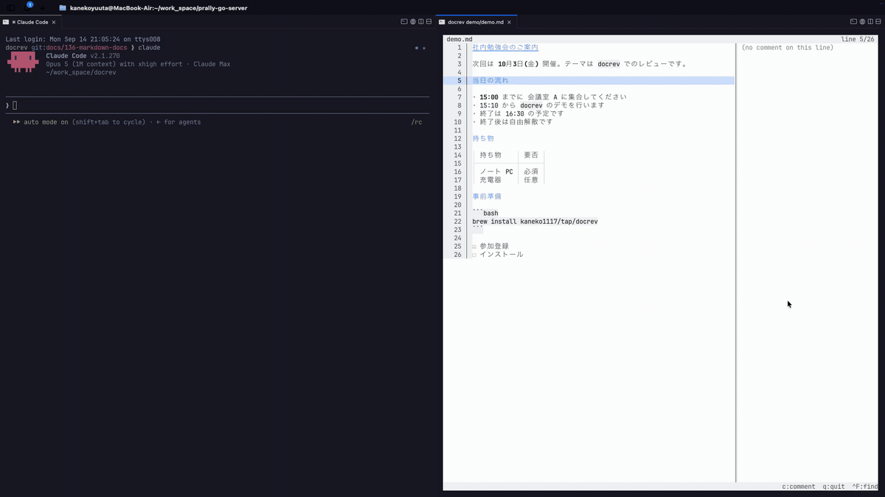

# docrev

[English README](README.md)

ターミナルで動くドキュメントビューア + インラインレビューコメント。AI エージェントとの協働を前提に設計されています。

ドキュメントをターミナルで開き、行やセルにコメントを付けると、AI エージェント(Claude など)が CLI 経由でそれを読み、対応し、返信します — 「コードレビューのドキュメント版」です。Markdown ファイルは行番号付きで 1 行ずつ、Excel ファイルはスプレッドシート風のグリッド(白いキャンバス・グリッド線・数式バー)で、ターミナル内に表示します。



> Markdown(`.md`)と Excel(`.xlsx`)の読み取り専用に対応。Word(`.docx`)対応は計画中です。

## インストール

```text
# macOS / Linux
brew install kaneko1117/tap/docrev
curl --proto '=https' --tlsv1.2 -LsSf https://github.com/kaneko1117/docrev/releases/latest/download/docrev-installer.sh | sh

# Windows
powershell -c "irm https://github.com/kaneko1117/docrev/releases/latest/download/docrev-installer.ps1 | iex"

# Rust の環境がある場合
cargo install docrev
```

macOS・Linux・Windows 向けのビルド済みバイナリは、各[リリース](https://github.com/kaneko1117/docrev/releases)に添付されています。

## 使い方

```text
docrev notes.md                    # ビューアで Markdown ファイルを開く
docrev file.xlsx                   # ビューアでブックを開く
docrev dump notes.md               # ファイルを行番号付きで出力(cat -n と同じ)
docrev dump file.xlsx              # シートをテキスト表として出力(--sheet <名前> で選択)
docrev dump file.xlsx --formulas   # 結果の代わりに数式を表示(Excel の Ctrl+` と同じ)
```

### Markdown

Markdown ファイルは、書かれたままの行に `cat -n` と同じ番号を付けて表示します。見出し・強調・コード・箇条書き・表・コードブロックはその場で見やすく装飾しますが、ファイルの 1 行は画面でも必ず 1 行のまま(長い行は折り返し、番号は 1 つだけ)なので、画面の行番号とエージェントが使う行番号は常に一致します。右パネルは(画面の幅が足りれば)常に開いていて、カーソル行のスレッドが表示されます。

| キー | 動作 |
|------|------|
| ↑ / ↓ | カーソル行の移動 |
| PgUp / PgDn | ページ送り |
| Home / End、Ctrl+Home / Ctrl+End | 最初 / 最後の行 |
| Ctrl+F | ファイル内検索(文字で移動、↓↑で次/前、Enter でその場に留まる、Esc で元の場所へ) |
| c | 行にコメント(既にスレッドがある行ではその続きに返信。解決済みでも同じ) |
| q / Ctrl+C | 終了 |

行をクリックで選択、ホイールで上下に動きます。**行をまたいでドラッグすると、その行がコピーされます**(装飾前の、ファイルに書かれたままの文字)。未解決スレッドのある行には `●` マーカーが付きます。

### Excel


| キー | 動作 |
|------|------|
| 矢印キー | カーソル移動 |
| PgUp / PgDn | ページ送り |
| Home / End | 行の先頭 / 末尾 |
| Ctrl+Home / Ctrl+End | シートの先頭 / 末尾 |
| Tab / Shift+Tab | シート切替 |
| Ctrl+G / F5 | シート名で移動(文字で絞り込み、Enter で切替) |
| Ctrl+F | シート内検索(文字で移動、↓↑で次/前、Enter でその場に留まる、Esc で元の場所へ) |
| c | セルにコメント(既にスレッドがあるセルではその続きに返信。解決済みでも同じ) |
| n | Excel 標準のコメントを表示(読み取り専用、Esc で閉じる) |
| q / Ctrl+C | 終了 |

セルをクリックで選択、下のタブをクリックでシート切替、`‹`/`›` で隣のシートへ。ホイールで上下(Shift+ホイールで左右)に動きます。**セル範囲をドラッグすると、その範囲がコピーされます** — 画面の見た目ではなくセルの完全な値がタブ区切りで入り、Excel や Google スプレッドシートにそのまま表として貼り付けられます。コピーは端末経由(OSC 52)なので SSH 越しでも手元のクリップボードに届きます。シート選択・検索・Excel コメントの表示が開いているときにクリックすると、それを閉じてすぐにクリックした場所へ移ります。

数式バーには、選択中のセルに数式があればその数式(`=SUM(E7:E34)`)、なければ値全体が表示されます(表側は Excel と同じく計算結果のまま)。未解決スレッドのあるセルには `●` マーカーが付きます。`c` を押すとスレッドが右パネルに開き、読むだけなら Esc、返信するならそのまま入力して Ctrl+S(パネルが入らない狭い画面では返信欄だけが開きます)。1 つのセルに持てるスレッドは 1 つで、`c` は常にその続きに書き込みます。解決済みのスレッドに返信すると、また未解決に戻ります。カーソルを合わせただけではパネルは開かず、表の幅は変わりません。Excel 上で付けられた標準コメント(メモ・スレッド)があるセルは右上の角に色が付き、`n` で読めます。Excel で設定したウィンドウ枠の固定はそのまま反映され、見出しの行・列が画面に残ります。

### コメントの入力欄

`c` を押すと、カーソルのある行やセルに入力欄が開きます。Enter = 改行、Ctrl+S = 保存、Esc = 閉じる。入力中も矢印キーやクリック(シートのタブを含む)でカーソルを動かせて、入力欄はカーソルについてきます。保存していない文章は行やセルごとに下書きとして残り(Esc で閉じても残ります)、保存するか docrev を終了するまで消えません。下書きがファイルに書き出されることはありません。

### 配色

既定ではスプレッドシート風の白い画面で表示します。ターミナル自身の配色を使いたい場合:

```text
docrev file.xlsx --theme terminal
export DOCREV_THEME=terminal        # 毎回指定したくない場合
```

`--theme` は `DOCREV_THEME` より優先されます。なお Excel ファイルが持つ塗りつぶし色と文字色は白い背景を前提にした色なので、`terminal` では反映しません。

## エージェント向けコマンド

エージェント(Claude など)は、次のコマンドであなたのコメントを読み、対応し、返信します:

```text
docrev comment list <ファイル> --json [--unresolved] [--author <名前>] [--sheet <名前>]
docrev comment add notes.md --line 13 --body "..." [--author <名前>]
docrev comment add file.xlsx --cell "Sheet1!B3" --body "..." [--author <名前>]
docrev comment reply <ファイル> --thread <id> --body "..." [--author <名前>]
docrev comment resolve <ファイル> --thread <id>
```

`list --json` の出力には、各コメントに**コメントが付いた場所の中身**が同梱されます。Markdown ファイルなら**その行の文字と前後 2 行ずつ**、Excel ファイルなら**そのセルの中身と同じ行の内容**です。エージェントはファイルを読みに行かなくても、受け取ったコメントの束にそのまま着手できます。

`--line` にはビューアに表示される行番号(1 から数える)を渡します。ファイルを書き換えても、コメントは同じ行番号に残ったままで、文字を追いかけては動きません。`--sheet` は Excel ファイル用です。

`add` は、指定した行やセルに既にスレッドがあればその続きに書き込みます(2 つ目のスレッドは作りません)。

コメントは元のファイルの隣に作られる専用ファイル(`notes.md.docrev.json`)に保存され、**元のドキュメントには一切書き込みません**。ビューアとエージェントが同時に書き込んでも壊れないよう保護されています。ファイル形式の詳細は [docs/sidecar.md](docs/sidecar.md) にあります。

## Claude と使う

[`skills/docrev-review/SKILL.md`](skills/docrev-review/SKILL.md) にエージェント向けの手順書があります。Claude Code なら、このリポジトリを配布元として登録し、プラグインとして入れるだけです:

```text
/plugin marketplace add kaneko1117/docrev
/plugin install docrev@docrev
```

ほかのエージェントでは手順書のファイルをそのまま使えます。Claude Code で手動で入れる場合は skills ディレクトリにコピーしてください:

```text
mkdir -p ~/.claude/skills/docrev-review
cp skills/docrev-review/SKILL.md ~/.claude/skills/docrev-review/
```

あとはビューアで行やセルにコメントを付けて、Claude に「notes.md にコメントした」(または「budget.xlsx にコメントした」)と伝えるだけ。返信はビューアが自動で拾って表示します。

## ライセンス

MIT または Apache-2.0(選択可)。
