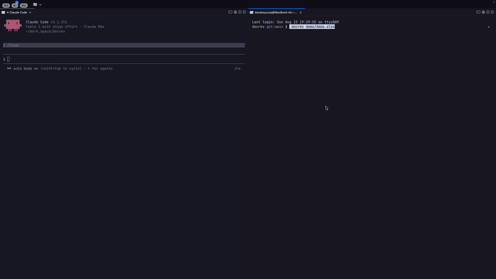

# docrev

[日本語版 README](README.ja.md)

A terminal document viewer with inline review comments, designed for AI agent workflows.

Open a document in your terminal, leave comments anchored to its content, and let an
AI agent read them through a CLI, act on them, and reply — think code review, but for
documents. The viewer paints a spreadsheet-style grid (white canvas, gridlines,
formula bar) right in your terminal.



> Excel (`.xlsx`), read-only. Word (`.docx`) support is planned.

## Installation

```text
# macOS / Linux
brew install kaneko1117/tap/docrev
curl --proto '=https' --tlsv1.2 -LsSf https://github.com/kaneko1117/docrev/releases/latest/download/docrev-installer.sh | sh

# Windows
powershell -c "irm https://github.com/kaneko1117/docrev/releases/latest/download/docrev-installer.ps1 | iex"

# with a Rust toolchain
cargo install docrev
```

Prebuilt binaries for macOS, Linux and Windows are attached to every
[release](https://github.com/kaneko1117/docrev/releases).

## Usage

```text
docrev file.xlsx                   # browse the workbook in a TUI
docrev dump file.xlsx              # print a sheet as a text table (--sheet <name> to pick one)
docrev dump file.xlsx --formulas   # formulas instead of results, like Excel's Ctrl+`
```

### Viewer keys

| Key | Action |
|-----|--------|
| Arrow keys | Move the cursor |
| PgUp / PgDn | Page up / down |
| Home / End | First / last column of the row |
| Ctrl+Home / Ctrl+End | Top / bottom of the sheet |
| Tab / Shift+Tab | Next / previous sheet |
| Ctrl+G / F5 | Go to a sheet by name (type to filter, Enter to switch) |
| Ctrl+F | Find on the active sheet (type to jump, ↓/↑ next/previous, Enter to stay, Esc to go back) |
| c | Comment on the cell (replies when the cell already has an open thread) |
| r | Reply to the thread on the cell |
| n | View the workbook's own Excel comments on the cell (read-only; Esc closes) |
| q / Ctrl+C | Quit |

### Mouse

Click a cell to select it, a sheet tab to switch, `‹`/`›` to step through
sheets; the wheel scrolls (Shift+wheel sideways). **Drag across cells to
copy the range** — the clipboard receives the full underlying values as
tab-separated text, ready to paste into Excel or Google Sheets as a table.
Copying uses OSC 52, so it reaches your local clipboard even over SSH. A
click always wins over an open prompt.

In the comment editor: Enter inserts a newline, Ctrl+S saves, Esc cancels.
The formula bar shows the selected cell's formula (`=SUM(E7:E34)`) when it
has one, and its full value otherwise — the grid keeps showing results,
like Excel. Cells with an open
thread are marked with `●`; press `c` on one to open its thread in a side
panel — read and `Esc` out, or type and `Ctrl+S` to reply. (On terminals too
narrow for the panel, `c` still opens the reply editor.) Moving the cursor
alone never opens the panel, so the grid keeps its width. Cells carrying the
workbook's own Excel comments show a tinted top-right corner; press `n` to
read them. Frozen
panes saved in the workbook are honored: pinned rows and columns stay on
screen while the rest scrolls.

### Colors

The viewer paints a spreadsheet-style white canvas by default. To keep your
terminal's own palette instead:

```text
docrev file.xlsx --theme terminal
export DOCREV_THEME=terminal        # or set it once
```

`--theme` wins over `DOCREV_THEME`. Workbook fill and font colors are absolute
RGB meant for white paper, so the `terminal` theme leaves them out.

## Agent CLI

The other half of the loop — an AI agent reads your comments, acts, and replies:

```text
docrev comment list file.xlsx --json [--unresolved] [--author <name>] [--sheet <name>]
docrev comment add file.xlsx --cell "Sheet1!B3" --body "..." [--author <name>]
docrev comment reply file.xlsx --thread <id> --body "..." [--author <name>]
docrev comment resolve file.xlsx --thread <id>
```

`list --json` emits the [sidecar schema](docs/sidecar.md), with each thread
carrying the anchored cell's content and its row — a batch of comments is
actionable without reading the sheets. `add`/`reply`/`resolve` print the
affected thread (including its id). Comments live in a sidecar file
(`file.xlsx.docrev.json`); the original document is never modified, and
concurrent TUI/CLI writes are serialized through a `.lock` file.

## Using with Claude (or any agent)

[`skills/docrev-review/SKILL.md`](skills/docrev-review/SKILL.md) teaches an agent the
full loop. For Claude Code, copy it into your skills directory:

```text
mkdir -p ~/.claude/skills/docrev-review
cp skills/docrev-review/SKILL.md ~/.claude/skills/docrev-review/
```

Then comment on cells in the viewer, tell Claude "I commented on budget.xlsx",
and watch the replies appear — the viewer picks them up on its own.

## License

MIT OR Apache-2.0, at your option.
